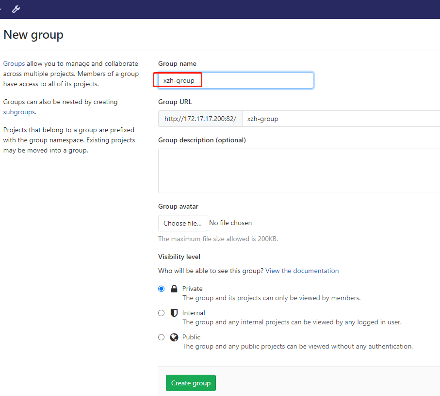
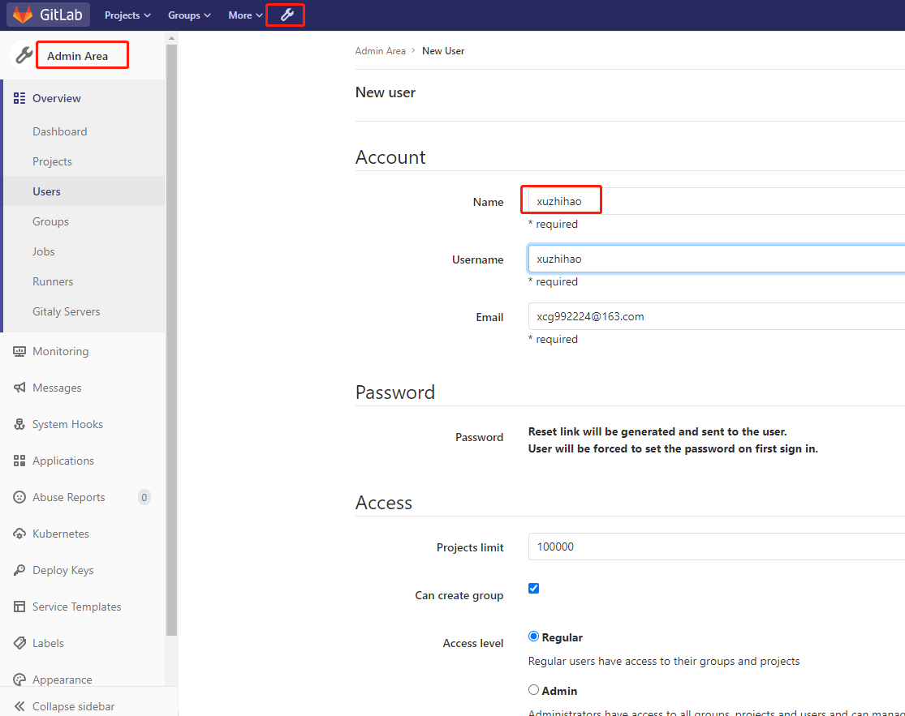
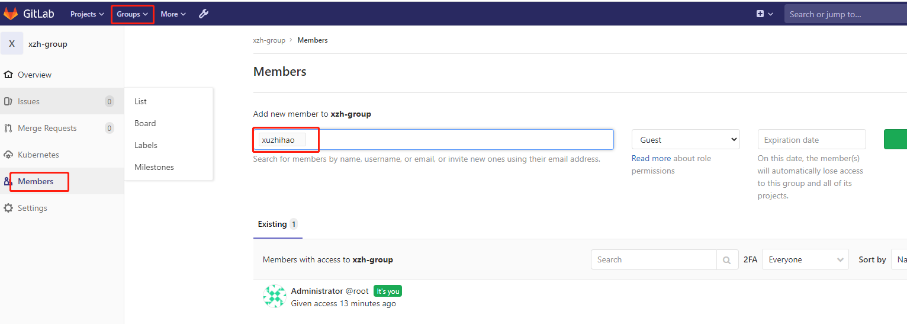
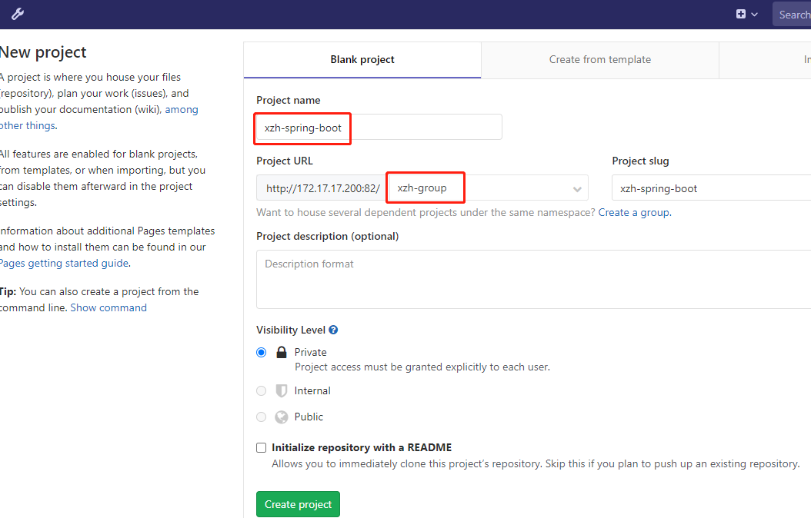

# Gitlab代码托管服务器安装

## 1. 安装

```bash
# 安装相关依赖
yum -y install policycoreutils openssh-server openssh-clients postfix
# 启动ssh服务&设置为开机启动
systemctl enable sshd && sudo systemctl start sshd
# 设置postfix开机自启，并启动，postfix支持gitlab发信功能
systemctl enable postfix && systemctl start postfix
# 开放ssh以及http服务，然后重新加载防火墙列表
firewall-cmd --add-service=ssh --permanent
firewall-cmd --add-service=http --permanent
firewall-cmd --reload
# 下载gitlab
wget https://mirrors.tuna.tsinghua.edu.cn/gitlab-ce/yum/el6/gitlab-ce-12.4.2-ce.0.el6.x86_64.rpm --no-check-certificate
# 安装
rpm -i gitlab-ce-12.4.2-ce.0.el6.x86_64.rpm --force --nodeps

# 修改gitlab配置
vi /etc/gitlab/gitlab.rb
external_url 'http://172.17.17.200:82'
nginx['listen_port'] = 82

# 重载配置及启动gitlab
gitlab-ctl reconfigure
gitlab-ctl restart
```

## 2. 配置

?> http://192.168.3.200:82/ 首次进入重置root账号密码

- 添加组



- 创建用户



- 修改密码


- 用户添加到组中



1) Guest - 访客
2) Reporter - 报告者
3) Developer - 开发者
4) Master - 主人
5) Owner - 拥有者


- 新用户身份登录创建项目




## 3. 客户端

- 下载

https://github.com/git-for-windows/git/releases/download/v2.23.0.windows.1/Git-2.23.0-64-bit.exe

- 项目Clone


- 打开Git命令行
  


```bash
git credential-manager uninstall # 清除掉缓存在git中的用户名和密码
git clone http://172.17.17.200:82/xzh-group/xzh-spring-boot.git
```

- 提交代码

```bash
cd xzh-spring-boot/           # 进入项目工程目录
git add .                     # 将当前修改的文件添加到暂存区
git commit -m "first commit"  # 提交代码
git push                      # 推送到远程仓库
git pull                      # 拉取代码
git checkout -b dev           # 切换并从当前分支创建一个dev分支
git push origin dev           # 将新创建的dev分支推送到远程仓库
```

## 4. git命令

1. Git全局设置
```bash
git config --global user.name "xuzhihao"
git config --global user.email "xcg992224@163.com"
```

2. 创建仓库
```bash
git clone http://172.17.17.200:82/xzh-group/xzh-spring-boot.git
cd xzh-spring-boot
touch README.md
git add README.md
git commit -m "add README"
git push -u origin master
```

3. 推送现有文件夹
```bash
cd existing_folder
git init
git remote add origin http://172.17.17.200:82/xzh-group/xzh-spring-boot.git
git add .
git commit -m "Initial commit"
git push -u origin master
```

4. 本地代码推送到仓库
```bash
cd existing_repo
git remote rename origin old-origin
git remote add origin http://172.17.17.200:82/xzh-group/xzh-spring-boot.git
git push -u origin --all
git push -u origin --tags
```

5. 其他
```bash
git checkout dev # 切换到dev分支
git status # 查看本地仓库文件状况
git branch # 查看本地所有分支
git log # 查看提交记录
```