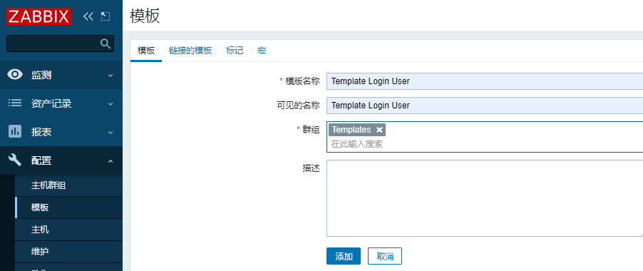
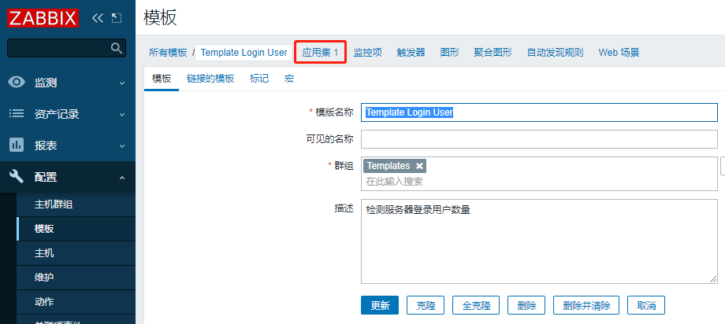
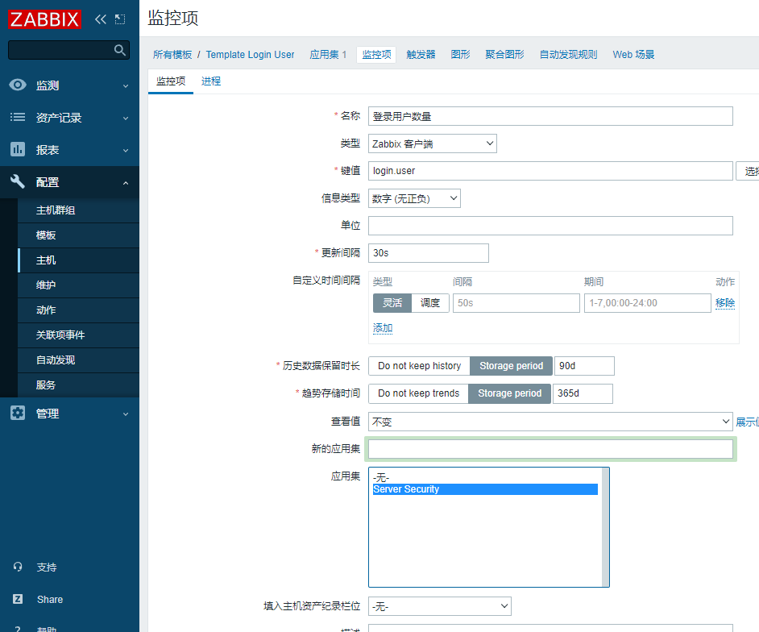
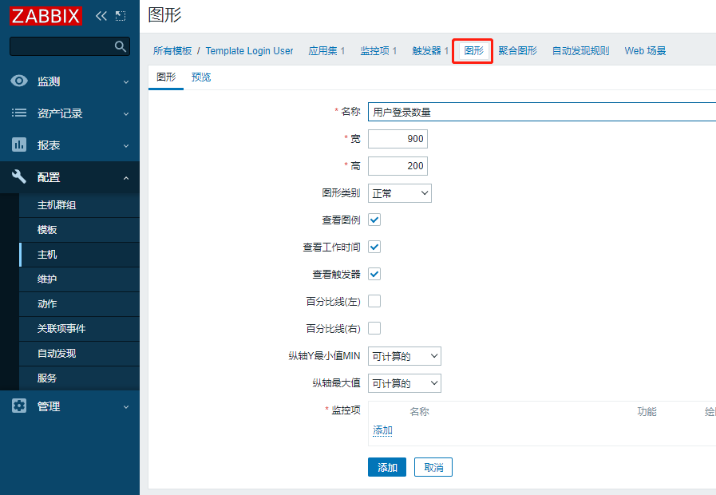
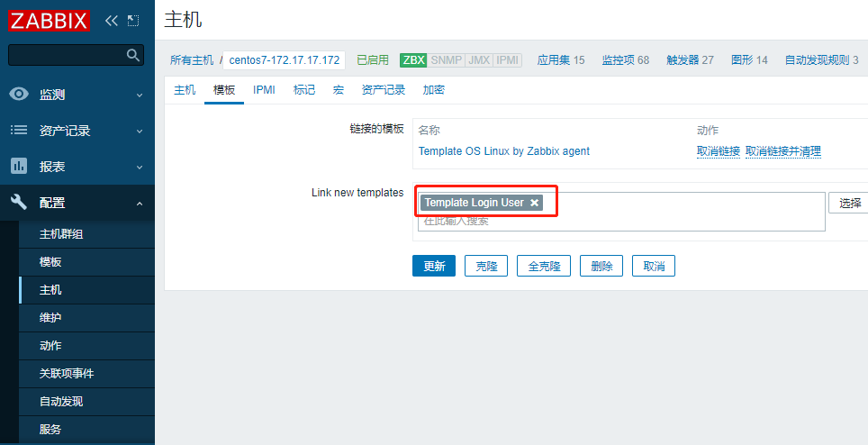
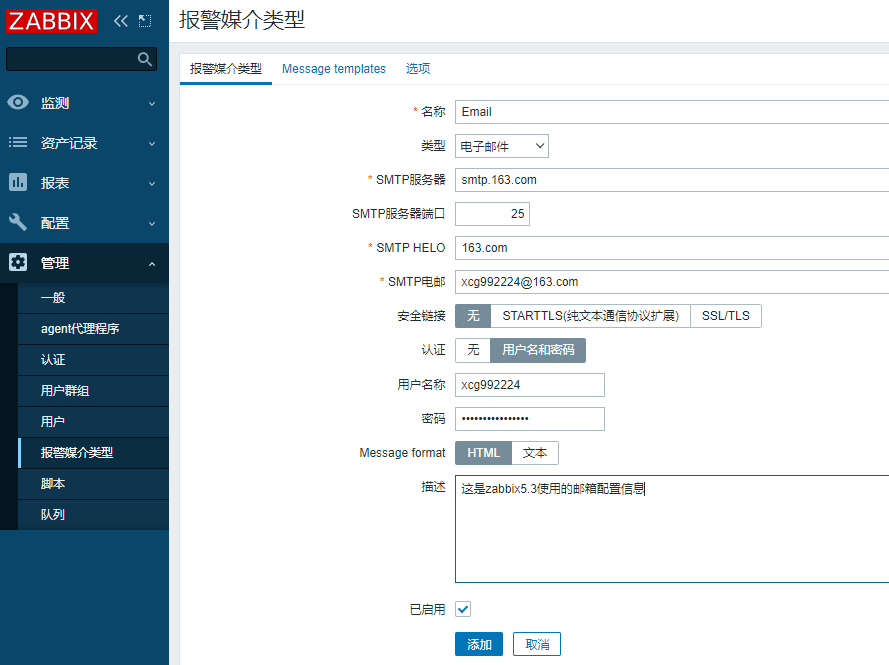
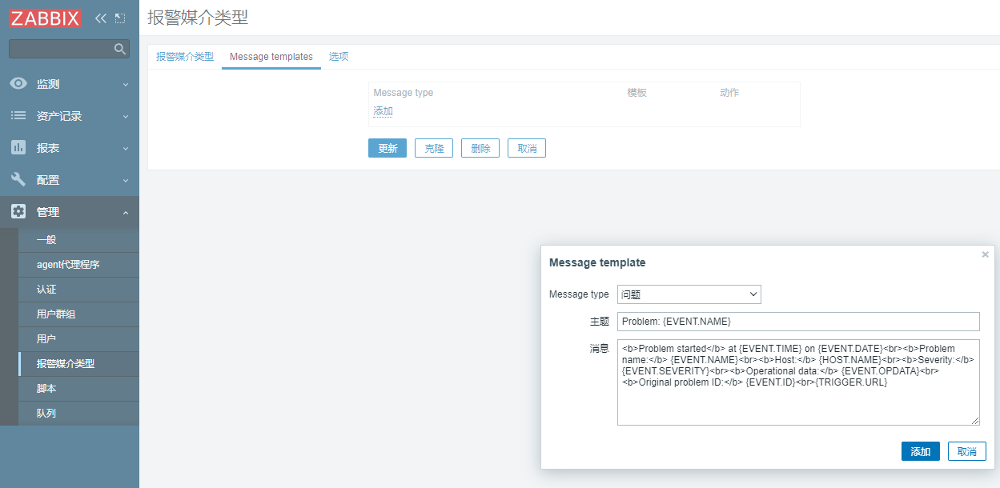
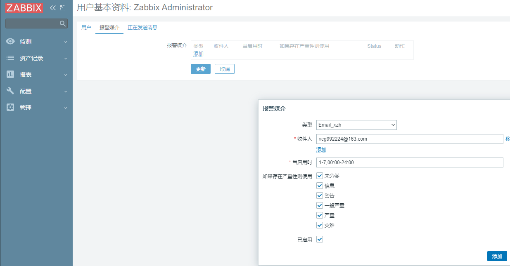
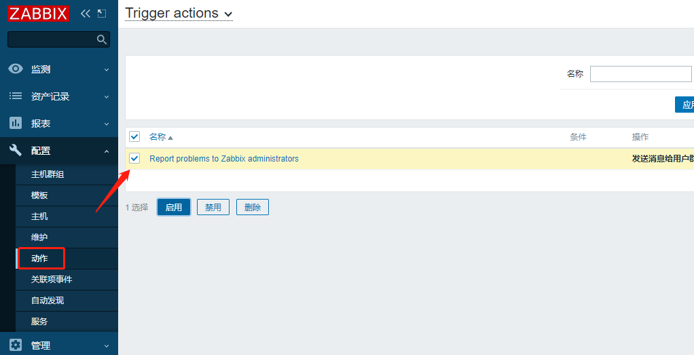

# Zabbix 5.0 LTS for CentOS 7, MySQL, Apache

https://www.zabbix.com/download


## 1. 准备工作

### 1.1 关闭防火墙

```bash
systemctl stop firewalld
systemctl disable firewalld
sed -i 's/SELINUX=.*/SELINUX=disabled/' /etc/selinux/config 
setenforce 0
```

### 1.2 添加本地DNS解析

```bash
vim /etc/hosts
192.168.3.200 zabbix.xuzhihao.net zabbix01
```

### 1.3 配置yum源

```bash
mv /etc/yum.repos.d/CentOS-Base.repo /etc/yum.repos.d/CentOS-Base.repo_bak  # 备份本地yum源
wget -O /etc/yum.repos.d/CentOS-Base.repo http://mirrors.aliyun.com/repo/Centos-7.repo  # 获取阿里yum源配置文件
```

替换阿里云zabbix源

```bash
rpm -Uvh https://mirrors.aliyun.com/zabbix/zabbix/5.0/rhel/7/x86_64/zabbix-release-5.0-1.el7.noarch.rpm
sed -i 's#http://repo.zabbix.com#https://mirrors.aliyun.com/zabbix#' /etc/yum.repos.d/zabbix.repo
yum clean all
yum makecache # 更新yum缓存
```

安装SCL源

```bash
yum install -y centos-release-scl
```

启用Zabbix前端源
```bash
vi /etc/yum.repos.d/zabbix.repo

[zabbix-frontend]
# 修改为
enabled=1

# 或者执行
sed -i '11 s/0/1/' /etc/yum.repos.d/zabbix.repo
```

## 2. 安装

### 2.1 zabbix-server和agent

```bash
yum install -y zabbix-server-mysql zabbix-agent
```

### 2.2 zabbix前端

```bash
yum install -y zabbix-web-mysql-scl zabbix-apache-conf-scl
```

### 2.3 mariadb

```bash
yum install -y mariadb-server
systemctl enable --now mariadb
```


## 3. 配置

### 3.1 初始化

```bash
mysql_secure_installation   # 设置root密码1234Qwer
mysql -uroot -p1234Qwer
create database zabbix character set utf8 collate utf8_bin;
grant all privileges on zabbix.* to zabbix@localhost identified by '123456';
grant all privileges on zabbix.* to zabbix@'192.168.3.%' identified by '123456';
grant all privileges on zabbix.* to zabbix@'zabbix.xuzhihao.net' identified by '123456';
flush privileges;
```

使用zabbix-mysql导入zabbix数据库信息

```bash
zcat /usr/share/doc/zabbix-server-mysql*/create.sql.gz | mysql -u zabbix -p zabbix  # 输入密码123456
```

### 3.2 修改配置文件

修改配置文件/etc/zabbix/zabbix_server.conf里的数据库密码

```bash
vim /etc/zabbix/zabbix_server.conf
DBHost=localhost
DBName=zabbix
DBUser=zabbix
DBPassword=123456
StartDiscoverers=2

sed -i -e "/.*DBPassword=.*/c DBPassword=123456" -e "/.*DBHost=.*/c DBHost=localhost" /etc/zabbix/zabbix_server.conf
egrep -v "(^#|^$)" /etc/zabbix/zabbix_server.conf   # 检查配置是否正确
```

### 3.3 修改php配置文件

#### 3.3.1 设置时区

```bash
vi /etc/opt/rh/rh-php72/php-fpm.d/zabbix.conf
# 修改为
php_value[date.timezone] = Asia/Shanghai
```

#### 3.3.2 修改引导页面（可选）

```bash
chown apache:apache /etc/zabbix/web/zabbix.conf.php
```

#### 3.3.3 安装中文字体

将windows下字体文件msyhbd.ttc拷贝并改名

```bash
cd ~
cp msyhbd.ttc /usr/share/zabbix/assets/fonts/graphfont.ttf
```

## 4. 启动服务

```bash
systemctl restart zabbix-server zabbix-agent httpd rh-php72-php-fpm
systemctl enable zabbix-server zabbix-agent httpd rh-php72-php-fpm
netstat -lntp|grep -E "zabbix|http|mysql|php"
```

访问地址：http://192.168.3.200/zabbix
- 默认账号：Admin
- 默认密码：zabbix

## 5. 客户端

### 5.1 时区同步

```bash
yum install -y ntpdate
timedatectl set-timezone Asia/Shanghai
/usr/sbin/ntpdate ntp4.aliyun.com;/sbin/hwclock -w
```

### 5.2 配置yum源

```bash
rpm -Uvh https://mirrors.aliyun.com/zabbix/zabbix/5.0/rhel/7/x86_64/zabbix-release-5.0-1.el7.noarch.rpm
sed -i 's#http://repo.zabbix.com#https://mirrors.aliyun.com/zabbix#' /etc/yum.repos.d/zabbix.repo
yum clean all
```

### 5.3 安装zabbix-agent2

```bash
yum install -y zabbix-agent2
```

### 5.4 修改配置

1. 客户端上报地址

```bash
vi /etc/zabbix/zabbix_agent2.conf

# 修改以下配置
Server=zabbix.xuzhihao.net
ServerActive=zabbix.xuzhihao.net
Hostname=Zabbix02
```

### 5.5 启动服务

```bash
systemctl start zabbix-agent2.service
systemctl enable zabbix-agent2.service
```

### 5.6 测试

```bash
grep -Ev '^#|$^' /etc/zabbix/zabbix_agent2.conf # 确认配置无误
netstat -lutp | grep 32160
cat /usr/lib/systemd/system/zabbix-agent2.service   # 查看启动文件

PIDFile=/run/zabbix/zabbix_agent2.pid
ExecStart=/usr/sbin/zabbix_agent2 -c $CONFFILE
```

服务器安装zabbix-get  

```bash
yum install -y zabbix-get
zabbix_get -s '192.168.3.201' -p 10050 -k 'agent.ping'
```

## 6. 自定义监控

### 6.1 客户端配置

#### 6.1.1 启用自定义配置

```bash
vi /etc/zabbix/zabbix_agent2.conf
# 修改
Include=/etc/zabbix/zabbix_agent2.d/*.conf
UnsafeUserParameters=1
```

#### 6.1.2 添加自定义key

```bash
cd /etc/zabbix/zabbix_agent2.d/
vi UserParameter.conf
# 添加
UserParameter=login.user,who|wc -l
```

#### 6.1.3 重启zabbix-agent

```bash
systemctl restart zabbix-agent2.service
```

#### 6.1.4 服务器测试

```bash
zabbix_get -s '192.168.3.201' -p 10050 -k 'login.user'
```

### 6.2 服务端配置

#### 6.2.1 添加模板

?> 配置-模板-创建模板



#### 6.2.2 创建应用集

?> 配置-模板-Template login user-应用集-创建应用集




#### 6.2.3 创建监控项

?> 配置-模板-Template login user-监控项-创建监控项



#### 6.2.4 创建触发器

?> 配置-模板-Template login user-触发器-创建触发器


#### 6.2.5 创建图形

?> 配置-模板-Template login user-图形-创建图形



#### 6.2.6 主机关联模板



#### 6.2.7 邮件报警

?> 管理-报警媒介类型-创建媒介类型(密码为邮箱授权码)





#### 6.2.8 用户设置

?> User settings-报警媒介



#### 6.2.9 激活报警

