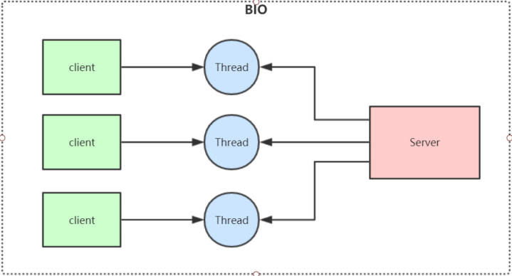
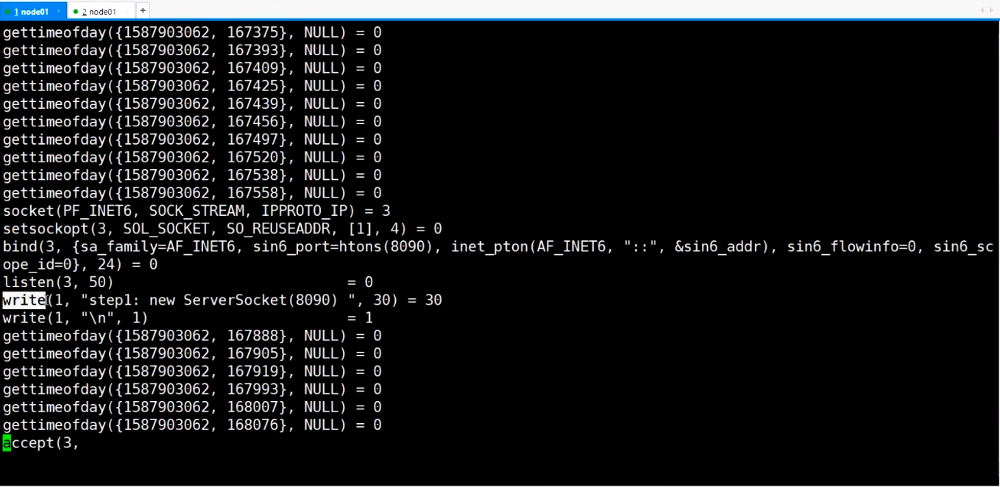
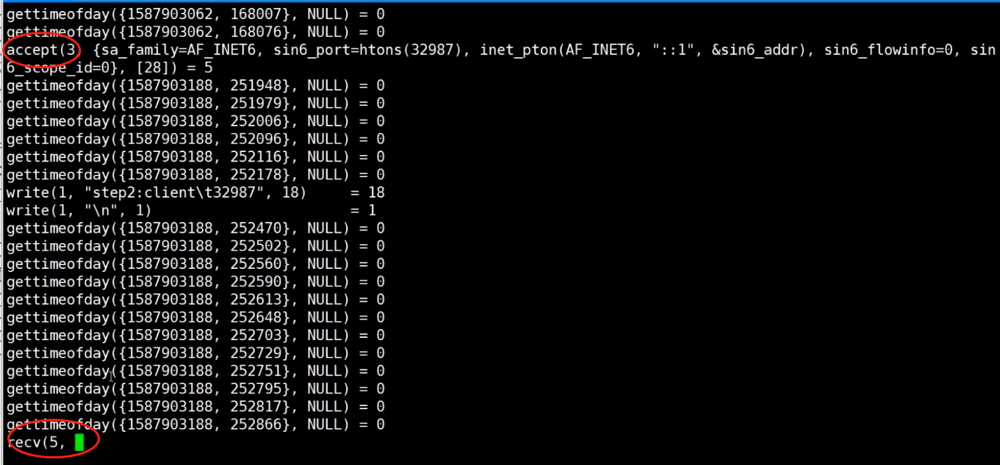
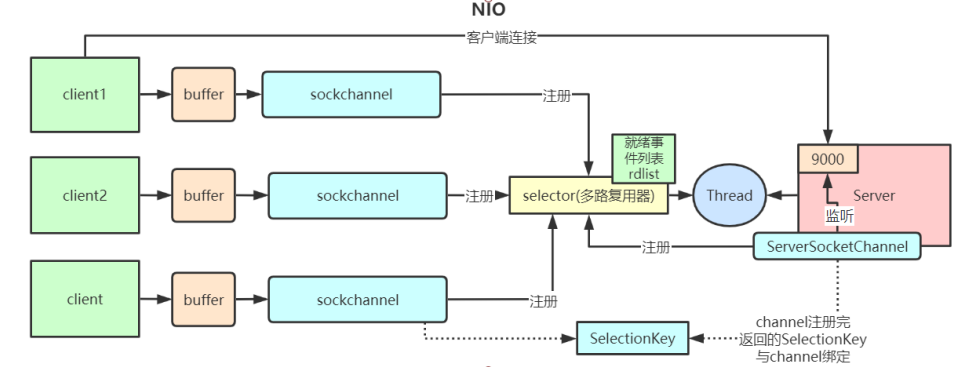
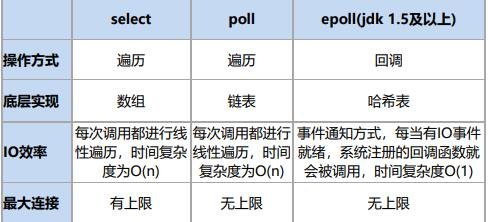

# IO模型

IO模型就是说用什么样的通道进行数据的发送和接收，Java共支持3种网络编程IO模式：BIO，NIO，AIO

## 1. BIO底层原理

同步阻塞模型，一个客户端连接对应一个处理线程



```java
public class BioServer {
	public static void main(String[] args) throws IOException {
		ServerSocket serverSocket = new ServerSocket(9000);
		while (true) {
			// 阻塞方法
			Socket clientSocket = serverSocket.accept();
			System.out.println("客户端:" + clientSocket.getInetAddress().getLocalHost() + "已连接到服务器");

			new Thread(new Runnable() {
				@Override
				public void run() {
					try {
						handler(clientSocket);
					} catch (IOException e) {
						e.printStackTrace();
					}
				}
			}).start();

		}
	}

	private static void handler(Socket clientSocket) throws IOException {
		byte[] bytes = new byte[1024];
		// 接收客户端的数据，阻塞方法，没有数据可读时就阻塞
		int read = clientSocket.getInputStream().read(bytes);
		System.out.println("read完毕。。");
		if (read != -1) {
			System.out.println("接收到客户端的数据：" + new String(bytes, 0, read));
		}
		clientSocket.getOutputStream().write("HelloClient".getBytes());
		clientSocket.getOutputStream().flush();
	}
}
```

缺点：

1、IO代码里read操作是阻塞操作，如果连接不做数据读写操作会导致线程阻塞，浪费资源

2、使用线程可以避免阻塞但是线程很多，会导致服务器线程太多，压力太大，比如C10K问题

应用场景：

BIO 方式适用于连接数目比较小且固定的架构， 这种方式对服务器资源要求比较高， 但程序简单易理解。


```bash
strace -ff -o out /usr/java/j2sdk1.4.2_18/bin/java BioServer
```
JDK1.4 accept和recv都会产生阻塞 





```bash
strace -ff -o out /usr/java/jdk1.8.0_202/bin/java BioServer,
```

JDK1.8 使用非阻塞模型poll


## 2. NIO底层原理

同步非阻塞，服务器实现模式为一个线程可以处理多个请求(连接)，客户端发送的连接请求都会注册到多路复用器selector上，多路复用器轮询到连接有IO请求就进行处理，JDK1.4开始引入。

```java
public class NioServer {
	// 保存客户端连接
	static List<SocketChannel> channelList = new ArrayList<>();

	public static void main(String[] args) throws IOException, InterruptedException {

		// 创建NIO ServerSocketChannel,与BIO的serverSocket类似
		ServerSocketChannel serverSocket = ServerSocketChannel.open();
		serverSocket.socket().bind(new InetSocketAddress(9000));
		// 设置ServerSocketChannel为非阻塞
		serverSocket.configureBlocking(false);
		System.out.println("服务启动成功");

		while (true) {
			// 非阻塞模式accept方法不会阻塞，否则会阻塞
			// NIO的非阻塞是由操作系统内部实现的，底层调用了linux内核的accept函数
			SocketChannel socketChannel = serverSocket.accept();
			if (socketChannel != null) { // 如果有客户端进行连接
				System.out.println(socketChannel.getRemoteAddress() + "连接成功");
				// 设置SocketChannel为非阻塞
				socketChannel.configureBlocking(false);
				// 保存客户端连接在List中
				channelList.add(socketChannel);
			}
			// 遍历连接进行数据读取
			Iterator<SocketChannel> iterator = channelList.iterator();
			while (iterator.hasNext()) {
				SocketChannel sc = iterator.next();
				ByteBuffer byteBuffer = ByteBuffer.allocate(128);
				// 非阻塞模式read方法不会阻塞，否则会阻塞
				int len = sc.read(byteBuffer);
				// 如果有数据，把数据打印出来
				if (len > 0) {
					System.out.println("接收到消息：" + new String(byteBuffer.array()));
				} else if (len == -1) { // 如果客户端断开，把socket从集合中去掉
					System.out.println(sc.getRemoteAddress() + "客户端断开连接");
					iterator.remove();
				}
			}
		}
	}
}
```

总结：

如果连接数太多的话，会有大量的无效遍历，假如有10000个连接，其中只有1000个连接有写数据，但是由于其他9000个连接没有断开，我们还是要每次轮询遍历一万次，其中有十分之九的遍历都是无效的，这显然不是一个让人很满意的状态。

应用场景：

NIO方式适用于连接数目多且连接比较短（轻操作） 的架构， 比如聊天服务器， 弹幕系统， 服务器间通讯，编程比较复杂

NIO引入多路复用器`Nio2Server.java`

```java
public class Nio2Server {
	public static void main(String[] args) throws Exception {
		// 创建NIO ServerSocketChannel
		ServerSocketChannel serverSocket = ServerSocketChannel.open();
		serverSocket.socket().bind(new InetSocketAddress(9000));
		// 设置ServerSocketChannel为非阻塞
		serverSocket.configureBlocking(false);
		// 打开Selector处理Channel，即创建epoll
		Selector selector = Selector.open();
		// 把ServerSocketChannel注册到selector上，并且selector对客户端accept连接操作感兴趣
		serverSocket.register(selector, SelectionKey.OP_ACCEPT);
		System.out.println("服务启动成功");
		while (true) {
			// 阻塞等待需要处理的事件发生
			selector.select();
			// 获取selector中注册的全部事件的 SelectionKey 实例
			Set<SelectionKey> selectionKeys = selector.selectedKeys();
			Iterator<SelectionKey> iterator = selectionKeys.iterator();
			// 遍历SelectionKey对事件进行处理
			while (iterator.hasNext()) {
				SelectionKey key = iterator.next();
				// 如果是OP_ACCEPT事件，则进行连接获取和事件注册
				if (key.isAcceptable()) {
					ServerSocketChannel server = (ServerSocketChannel) key.channel();
					SocketChannel socketChannel = server.accept();
					socketChannel.configureBlocking(false);
					// 这里只注册了读事件，如果需要给客户端发送数据可以注册写事件
					socketChannel.register(selector, SelectionKey.OP_READ);
					System.out.println(socketChannel.getRemoteAddress() + "连接成功");
				} else if (key.isReadable()) { // 如果是OP_READ事件，则进行读取和打印
					SocketChannel socketChannel = (SocketChannel) key.channel();
					ByteBuffer byteBuffer = ByteBuffer.allocate(128);
					int len = socketChannel.read(byteBuffer);
					// 如果有数据，把数据打印出来
					if (len > 0) {
						System.out.println("接收到消息：" + new String(byteBuffer.array()));
					} else if (len == -1) { // 如果客户端断开连接，关闭Socket
						System.out.println(socketChannel.getRemoteAddress() + "断开连接");
						socketChannel.close();
					}
				}
				// 从事件集合里删除本次处理的key，防止下次select重复处理
				iterator.remove();
			}
		}
	}
}
```

NIO 有三大核心组件： Channel(通道)， Buffer(缓冲区)，Selector(多路复用器)
- 1、channel 类似于流，每个 channel 对应一个 buffer缓冲区，buffer 底层就是个数组
- 2、channel 会注册到 selector 上，由 selector 根据 channel 读写事件的发生将其交由某个空闲的线程处理
- 3、NIO 的 Buffer 和 channel 都是既可以读也可以写



NIO底层在JDK1.4版本是用linux的内核函数select()或poll()来实现，跟上面的NioServer代码类似，selector每次都会轮询所有的sockchannel看下哪个channel有读写事件，有的话就处理，没有就继续遍历，JDK1.5开始引入了epoll基于事件响应机制来优化NIO

NioSelectorServer 代码里如下几个方法非常重要，我们从Hotspot与Linux内核函数级别来理解下

```java
Selector.open() //创建多路复用器
socketChannel.register(selector, SelectionKey.OP_READ) //将channel注册到多路复用器上
selector.select() //阻塞等待需要处理的事件发生
```


总结：

NIO整个调用流程就是Java调用了操作系统的内核函数来创建Socket，获取到Socket的文件描述符，再创建一个Selector对象，对应操作系统的Epoll描述符，将获取到的Socket连接的文件描述符的事件绑定到Selector对应的Epoll文件描述符上，进行事件的异步通知，这样就实现了使用一条线程，并且不需要太多的无效的遍历，将事件处理交给了操作系统内核(操作系统中断
程序实现)，大大提高了效率

Epoll函数

```c
int epoll_create(int size);
int epoll_ctl(int epfd, int op, int fd, struct epoll_event *event);
int epoll_wait(int epfd, struct epoll_event *events, int maxevents, int timeout);
```

I/O多路复用底层主要用的Linux 内核函数（select，poll，epoll）来实现，windows不支持epoll实现，windows底层是基于winsock2的select函数实现的(不开源)



**Redis就是典型的基于epoll的NIO线程模型(nginx也是)，epoll实例收集所有事件(连接与读写事件)，由一个服务端线程连续处理所有事件命令。**

**Redis底层关于epoll的源码实现在redis的src源码目录的ae_epoll.c文件里**


## 3. AIO底层原理

异步非阻塞， 由操作系统完成后回调通知服务端程序启动线程去处理， 一般适用于连接数较多且连接时间较长的应用

```java
public class AioServer {
	public static void main(String[] args) throws Exception {
		final AsynchronousServerSocketChannel serverChannel = AsynchronousServerSocketChannel.open()
				.bind(new InetSocketAddress(9000));

		serverChannel.accept(null, new CompletionHandler<AsynchronousSocketChannel, Object>() {
			@Override
			public void completed(AsynchronousSocketChannel socketChannel, Object attachment) {
				try {
					System.out.println("2‐‐" + Thread.currentThread().getName());
					// 再此接收客户端连接，如果不写这行代码后面的客户端连接连不上服务端
					serverChannel.accept(attachment, this);
					System.out.println(socketChannel.getRemoteAddress());
					ByteBuffer buffer = ByteBuffer.allocate(1024);
					socketChannel.read(buffer, buffer, new CompletionHandler<Integer, ByteBuffer>() {
						@Override
						public void completed(Integer result, ByteBuffer buffer) {
							System.out.println("3‐‐" + Thread.currentThread().getName());
							buffer.flip();
							System.out.println(new String(buffer.array(), 0, result));
							socketChannel.write(ByteBuffer.wrap("HelloClient".getBytes()));
						}

						@Override
						public void failed(Throwable exc, ByteBuffer buffer) {
							exc.printStackTrace();
						}
					});
				} catch (IOException e) {
					e.printStackTrace();
				}
			}

			@Override
			public void failed(Throwable exc, Object attachment) {
				exc.printStackTrace();
			}
		});
		System.out.println("1‐‐" + Thread.currentThread().getName());
		Thread.sleep(Integer.MAX_VALUE);
	}
}
```

在Linux系统上，AIO的底层实现仍使用Epoll，没有很好实现AIO，因此在性能上没有明显的优势，而且被JDK封装了一层不容易深度优化，Linux上AIO还不够成熟。Netty是异步非阻塞框架，Netty在NIO上做了很多异步的封装